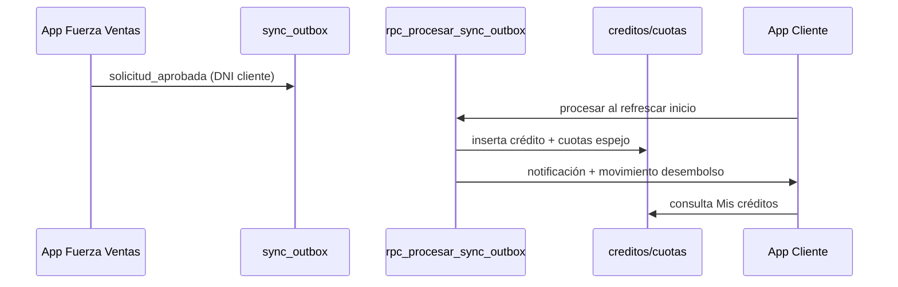

# Arquitectura — App Clientes Banco Pichincha

## Capas (MVVM simplificado)

```
lib/
├── models/          # Entidades de dominio (Usuario, Credito, Cuota…)
├── services/        # Acceso a datos y reglas (Supabase)
│   ├── supabase_service.dart
│   ├── auth_service.dart
│   ├── bank_data_service.dart
│   ├── sync_integration_service.dart
│   └── secure_session_service.dart
├── screens/         # UI por flujo de usuario
├── widgets/         # Componentes reutilizables
├── theme/           # Identidad visual Pichincha
└── utils/           # Formateo (sin intl)
```

## Base de datos compartida (bd_core_mobile / Supabase)

| Tabla | Uso |
|-------|-----|
| `usuarios` | Perfil cliente (vinculado a `auth.users`) |
| `profiles` | Rol RBAC + intentos login |
| `cuentas_ahorro` | Saldos y CCI |
| `movimientos` | Historial transaccional |
| `creditos` / `cuotas` | Productos crediticios + cronograma |
| `cr_creditos` / `cr_cuotas` | Espejo núcleo financiero (rúbrica) |
| `sync_outbox` / `sync_log` | Puente FVentas → cliente |
| `transferencias` | Envíos interbancarios |
| `pagos_servicios` | Pagos de servicios |
| `tarjetas` | Débito VISA |
| `notificaciones` | Bandeja |

## Flujo de integración



## Seguridad

- **JWT:** Supabase Auth emite access/refresh token.
- **Almacenamiento:** `flutter_secure_storage` persiste tokens y DNI.
- **RLS:** cada tabla filtra por `auth.uid()` o rol en `profiles`.
- **Bloqueo:** 5 intentos fallidos → bloqueo 15 min (`profiles.locked_until`).
